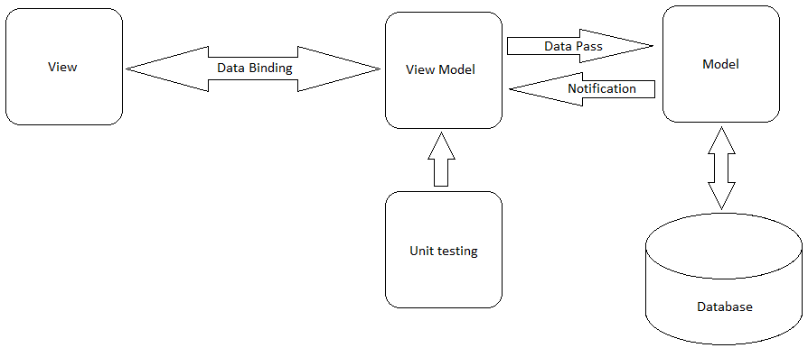

# Representação da Arquitetura

## Modelo de Arquitetura

O modelo de arquitetura adotado foi XXX \(MVC, MVP, MVVM, ...\)

Explicar a lógica entre as camadas

* A
* B
* C
* D

Explicar  as abstrações das camadas \(ou seja, cada camada e "explodir"\)

## Visão Lógica

### Diagrama de Classes

### Banco de Dados

###  

