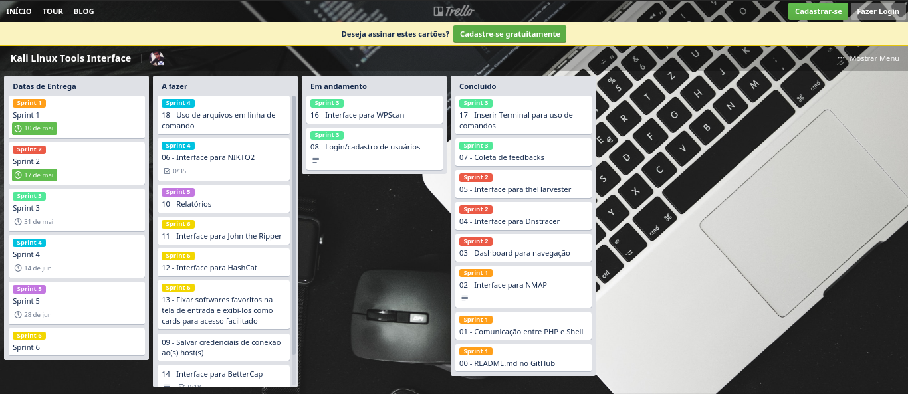

# Sprint Backlog

O controle de execução das tarefas foi realizado com a ferramenta <a href="https://www.trello.com">Trello</a>.

O quadro do projeto pode ser visualizado por completo <a href="https://trello.com/b/8jdVWd55/kali-linux-tools-interface">clicando aqui</a>.

	

